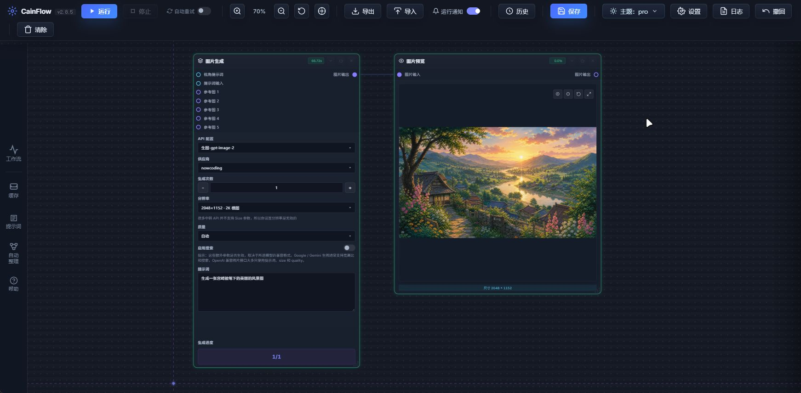

> [!NOTE]
> 🙏 **感谢** 微信用户 **Ray** 为本项目提供了代码，并在模块化重构过程中给予了重要帮助

# CainFlow

**CainFlow** 是一款受 ComfyUI 启发的轻量级节点式 AI 编排工具。基于原生网页技术构建，开箱即用、依赖简单、交互流畅，适合快速搭建与运行节点式 AI 工作流。

[📖 查看使用手册](USER_GUIDE.md)

---

## 📥 下载体验

### [点击此处下载最新完整版 ZIP](https://github.com/RingoCaviar/CainFlow/releases/latest)

- **推荐普通用户**：直接下载发布版，解压后即可启动
- **推荐开发者**：下载源码后使用 Python 本地运行

---

## 🖼️ 界面预览

---

## ✨ 项目亮点

CainFlow 是一款强调 **轻量、稳定、可控与高效编排** 的节点式 AI 工作流工具。

### ⚡ 高效执行
- **并行工作流引擎**：独立分支可自动并行运行，并支持并发请求状态追踪。
- **智能重试与结果透传**：可按需开启自动重试，部分请求失败时仍能把成功结果继续传递到下游。
- **节点耗时记录**：记录节点与图片生成耗时，方便定位慢步骤与复盘生成结果。

### 🎨 顺滑交互
- **无限画布与智能连线**：支持拖拽编排、快速聚焦、连接线剪断与更清晰的节点连接路径。
- **自适应画布 UI**：顶部与左侧菜单栏可自动隐藏或固定显示，减少遮挡并提升画布空间利用率。
- **内置图片预览与编辑**：支持全屏查看、历史回看、图片编辑、撤回与主题适配画板。

### 🛡️ 本地可控
- **本地运行与本地存储**：工作流、历史记录与配置默认保存在本机，适合个人创作与长期整理。
- **可控代理策略**：支持内置代理转发；关闭 CainFlow 代理时会强制直连，不跟随系统代理。
- **工作流资产管理**：支持保存、读取、重命名、复制粘贴与预设复用，方便沉淀常用流程。

---
## 🆕 v2.8.5 更新内容

🎉 `v2.8.5` 已发布。本轮更新重点打磨了 **图片预览与编辑、历史记录、并发请求、画布菜单、代理直连与 GPT 生图规则** 等高频使用链路。

### 更新内容

- 🖼️ 优化 **图片预览、全屏查看与图片编辑** 体验，进入图片查看时不再误触发顶部菜单栏。
- 🎨 图片编辑画板升级为主题适配的柔和棋盘格，并修复粗细参数预览挤压滑动条的问题。
- 📚 增强 **历史记录面板**，缩略图可显示每张图的生成耗时，全屏历史标题更紧凑，批量选择按钮支持再次点击退出。
- ⚡ 优化 **并发请求逻辑**：未手动开启自动重试时不再自动重试，部分失败时会继续把成功结果传递到下游。
- 🔴 升级节点顶部 **并发状态点 UI**，每行 5 个状态点，失败点可点击查看具体错误原因，并适配不同主题。
- 🧠 OpenAI / GPT 图片生成新增质量参数，并更新分辨率预设与校验规则，支持符合规范的 4K 横图与竖图尺寸。
- 🧭 优化顶部菜单栏与左侧菜单栏的自动隐藏、固定显示、触发距离和碰撞避让，减少遮挡通知、右键菜单和面板按钮的情况。
- 🌐 调整代理行为：当 CainFlow 代理关闭时强制直连，不再跟随系统代理或 Clash 系统代理模式。
- 🧩 修复图片预览节点、智能对话回复框、节点输入输出兼容与中文 UTF-8 显示相关问题，降低隐形数据兼容风险。
- 🔢 统一版本号管理，当前应用版本更新至 `v2.8.5`。

### 总结

这轮更新重点提升了日常使用中的确定性：**预览更沉浸、并发更透明、历史更可追踪、网络行为更可控、画布 UI 更少误挡**。

---

## 🚀 使用方式

本项目提供两种运行方式，推荐优先使用 **方式一**。

### 方式一：下载发布版（推荐，无需 Python）
1. 前往 [Releases](https://github.com/RingoCaviar/CainFlow/releases/latest) 页面下载最新 `.zip`。
2. 解压文件。
3. 双击目录中的 **`CainFlow.exe`** 直接启动。

> 该版本已内置完整运行环境，无需额外安装 Python。

### 方式二：下载源码运行（适合开发者，需 Python）
1. 下载源码 ZIP，或通过 Git 克隆本项目。
2. 确保本机已安装 **Python 3.x**。
3. 进入项目目录后，双击运行 **`start_cainflow.bat`**。

> 脚本会自动检查依赖并启动本地服务。

> [!NOTE]
> 程序启动后会自动打开 `http://127.0.0.1:8767`。如果浏览器未自动弹出，请手动访问该地址。

---

## 🌟 推荐供应商

本项目默认已配置 **[6789API](https://www.6789api.top/)**，提供稳定、高速的 AI 接口服务，覆盖主流多模态模型。

**快速开始：**
在设置面板中填入您的 **API 密钥** 后即可直接使用。

---

## 🔒 隐私说明

所有数据默认保存在本地，本工具不会主动泄露您的 API 密钥与隐私信息。

---

## 📌 当前版本

**最新版本：v2.8.5**
**发布日期：2026-05-20**

---

## 📈 Star History

