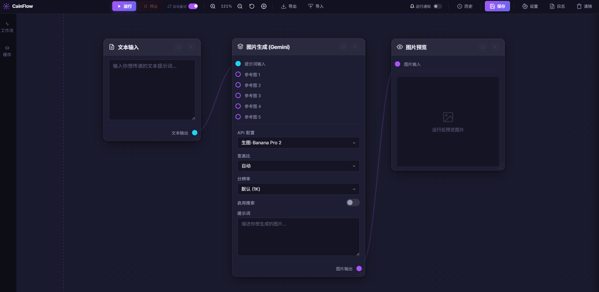

# CainFlow 

**CainFlow** 是一款受 ComfyUI 启发的轻量级节点式 AI 编排工具。基于原生网页技术，免去复杂依赖，多端适配且交互极速。

---

### 📥 [点击此处一键下载本项目 (最新完整版 ZIP)](https://github.com/RingoCaviar/CainFlow/releases/latest)

---

### 🖼️ 预览截图

---
## 🧩 核心功能与亮点

**CainFlow** 不仅仅是一个简单的 AI 界面，它通过底层架构的深度优化，为您提供了一个专业、稳定且交互极速的编排平台。

### ⚡ 极致性能与并行执行
*   **「就绪即出发」并行引擎**：告别排队！互不干扰的任务分支会自动并行执行，利用多核性能实现任务处理速度翻倍。
*   **120FPS 丝滑流畅**：通过全局 DOM 缓存与渲染加速技术，即使在处理包含超多节点的大型复杂工作流时，依然保持指尖级的响应。

### 🛡️ 专业级稳定性保障
*   **智能心跳监测**：服务端实时感知连接状态。如果网页意外刷新或关闭，系统会自动清理后台卡住的 API 请求，杜绝资源浪费。
*   **运行前「全量体检」**：内置 Pre-flight 校验系统。点击运行前自动检查 API 密钥及输入完整性，从源头解决“运行报错”的烦恼。
*   **SSRF 加固防御**：内置后端安全代理，确保在分布式网络或内网环境下的请求安全无忧。

### 🎨 深度交互体验
*   **全场景画布导航**：无限长坐标轴系统配有“一键聚焦”功能，无论工作流多庞大，按下 `F` 即可瞬间回正。
*   **智能弹性节点布局**：节点具备“内容感知”能力，缩小至内容边界时自动锁定（防止重叠），且在出现报错或长文本时会自动向下扩展（Smart Expansion），确保交互始终优雅。
*   **专业级内置编辑器**：无需第三方工具，内置高性能图片编辑器支持 20 步撤回、HSB 色环及形状绘制。
*   **深度响应式布局**：无论是超宽屏还是分屏模式，工具栏与设置面板会自动智能排布，始终为您保留最舒适的设计视口。
*   **多级撤回 (Undo/Redo)**：支持最高 5 步画布撤回，误操作后通过 `Ctrl + Z` 即可瞬间恢复，灵感不再因犹豫而中断。
*   **全局帮助中心**：左侧边栏内置「操作帮助」面板，覆盖所有快捷键与手势操作，新手秒上手。
*   **强制刷新提醒**：内置版本感知的浮动提示，确保您始终在运行最新、最稳定的前端代码。

### 📦 资产与自动化管理
*   **智能重试系统 (Auto-Retry+)**：支持自定义最大重试次数（默认 15 次），在高并发或网络波动时自动填坑，大幅提升无人值守运行的成功率。
*   **全量节点计时系统**：精准记录每个步骤的耗时，通过 Node Timing Pro 实现工作流效率量化分析。
*   **剪贴板系统 2.0 增强**：支持「时序优先级」粘贴。智能识别内部节点复制与外部图片/文本拷贝，始终为您呈现最后一次复制的内容。
支持选中节点原地替换素材，且所有副本均具备 IndexedDB 级持久化保障，刷新不丢图。
*   **一键式快照管理**：内置工作流管理器，支持保存、载入与批量重命名，您的每个灵感触点都将被妥善保存。

## 🚀 使用方式

本项目提供两种运行方式，推荐使用 **方式一** 以获得最简便的体验。

### 方式一：下载发布版（推荐，无需 Python）
1. 前往 **[Releases](https://github.com/RingoCaviar/CainFlow/releases/latest)** 页面下载最新的 `.zip` 压缩包。
2. 解压下载的文件。
3. 双击目录下的 **`CainFlow.exe`** 即可直接启动。
   - *此版本已内置完整的运行环境，您的电脑无需提前安装 Python。*

### 方式二：下载源代码（适合开发者，需 Python）
1. 点击本页面上方的 **`Code` -> `Download ZIP`** 或通过 Git 克隆本项目。
2. 确保您的电脑已安装 **Python 3.x** 环境。
3. 解压并进入项目目录，双击运行 **`start_cainflow.bat`**。
   - *此脚本会自动检查依赖并启动服务端。*

> [!NOTE]
> 程序启动后，浏览器会自动打开 `http://127.0.0.1:8767`。若未自动打开，请手动在浏览器地址栏输入该地址。

---

## 🌟 推荐供应商

本项目默认已配置 **[6789API](https://www.6789api.top/)**。该平台提供稳定、高速的 AI 接口服务，包含所有主流多模态模型。

**快速开始：**
只需在设置面板中填入您的 **API 密钥** 即可直接使用。

---
*🔒 **隐私提示**：所有数据均存储在本地，本工具不泄露您的 API 密钥及隐私。*

**最新版本**: v2.5 (2026-04-06)
