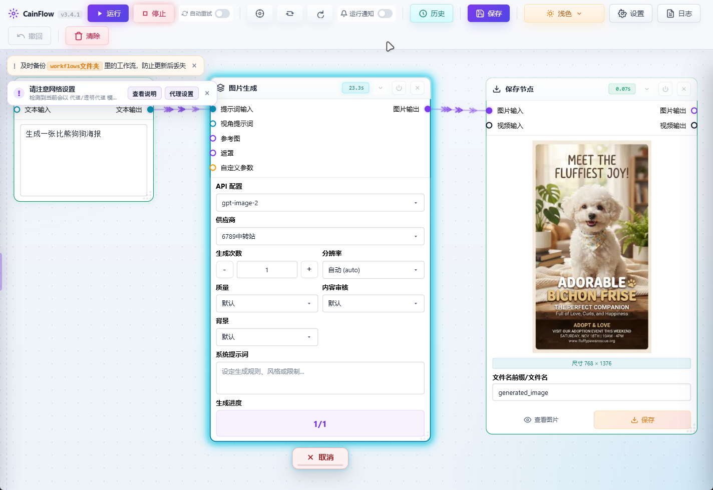

# CainFlow

**CainFlow** 是一款受 ComfyUI 启发的轻量级节点式 AI 编排工具。发布版使用 pywebview 提供独立桌面窗口，配合内置 Python 服务提供工作流、设置、媒体恢复、更新与下载等能力。

## 下载

- 发布版下载：<https://github.com/RingoCaviar/CainFlow/releases/latest>
- 推荐普通用户直接下载发布版 ZIP，解压后启动即可
- 推荐开发者克隆源码后本地运行，便于调试前端与后端逻辑

## 功能特点

- 节点式工作流编排，适合串联图片、文本、视频等多种处理流程
- 原生前端实现，启动轻量，易于按模块扩展
- 本地保存工作流与历史数据，默认不依赖云端托管
- 内置工作流管理、媒体恢复、下载、更新和日志能力
- 提供 Windows 发布版，并支持构建 macOS 发布包

## 当前版本

- 版本来源：[js/core/constants.js](D:/mygithub/CainFlow/js/core/constants.js) 中的 `APP_VERSION_NUMBER`
- 最新发布版请以 [GitHub Releases](https://github.com/RingoCaviar/CainFlow/releases/latest) 为准

## 运行方式

### 方式一：使用发布版

1. 前往 [Releases](https://github.com/RingoCaviar/CainFlow/releases/latest) 下载最新压缩包。
2. Windows 用户解压后运行 `CainFlow.exe`。
3. macOS 用户解压后运行 `CainFlow`，首次运行如被系统拦截，需要在系统安全设置中手动放行。

Windows 桌面版使用系统 WebView2 Runtime。Windows 11 已内置；少数缺失该组件的设备启动时可选择“使用浏览器模式”“打开 WebView2 官方安装页面”或“退出”。浏览器回退模式优先使用本地端口 8767；该端口不可用时会询问是否改用随机端口，并保留一个用于重新打开浏览器或停止 CainFlow 服务的状态窗口。也可以直接访问[微软 WebView2 官方下载页面](https://developer.microsoft.com/microsoft-edge/webview2/)进行安装。

### 方式二：源码运行

适合需要修改前端、后端或打包脚本的开发者。

1. 安装 Python 3，并运行 `python -m pip install -r requirements.txt`。
2. 克隆或下载本仓库源码。
3. 在项目根目录运行 [start_cainflow.bat](D:/mygithub/CainFlow/start_cainflow.bat)。
4. 默认打开独立桌面窗口；如需浏览器调试，运行 `python server.py --browser --port 8767`。

说明：

- 启动脚本会优先使用 `python_runtime\python.exe`，否则回退到系统中的 `python` 或 `py`
- 当前 Python 运行时依赖记录在根目录 [requirements.txt](D:/mygithub/CainFlow/requirements.txt)，如果你新增了 Python 依赖，记得同步补充
- 桌面模式使用随机回环端口并限制单实例运行，不受 `8767` 占用影响
- Windows 数据保存在程序旁；macOS 数据保存在 `~/Library/Application Support/CainFlow/`

## 默认供应商

首次使用前请在设置面板中填写自己的 API Key，并根据实际情况修改接口地址。

## 隐私与数据

- 工作流与大部分配置默认保存在本地
- API Key 由本地应用保存与使用
- 更新、下载、代理探测等能力会按你的配置访问外部网络

## 🙏 致谢
感谢真诚、友善、团结、专业的 Linuxdo 社区，让我用到那么多Token

[LinuxDo](https://linux.do/)

## 开源许可

CainFlow 主项目使用 [GNU GPL v3.0](LICENSE)。

仓库中包含随源码分发的第三方组件：

- `js/vendor/three.module.js`：Three.js，使用 MIT License

更多第三方版权与许可说明见 [NOTICE](D:/mygithub/CainFlow/NOTICE)。

## Star History

